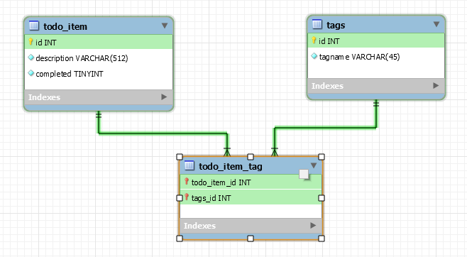

# [SocialHackersAcademy](https://www.socialhackersacademy.org/) - Database module - week 1 homework

[Instructions from SHA](https://github.com/SocialHackersCodeSchool/databases/blob/master/Week1/MAKEME.md)

## Draw a database design for a TODO App

Design a database for an app that keeps track of TODO lists of its users. In this app
a user can:

- Create a TODO item with some text in it
- Add tags to the TODO items, like `homework`, `groceries` etc...
- Mark a TODO item as done

**Answer - The diagram**
<br>



**Bonus round:**

Write a `todo.sql` file and put it in the homework folder where you create the database
structure from you ERD. Make sure you can use the `source` command in MySQL to create
the database.

**Answer - The .sql file**
<br>
[`source` file to create the database and the tables](todoapp.sql)
## World database queries

Create a database called `world` and `source` the SQL data from the
[databases/world](https://github.com/SocialHackersCodeSchool/databases/blob/master/Week1/databases/world.sql) file into the database.

Answer the following questions using the `world` database and put you answers in
homework/world-queries.txt

1. What are the names of all the cities in the Netherlands?

   **Answer**

```sql
   SELECT city.Name FROM city JOIN country
     ON city.CountryCode=country.Code
     WHERE country.Name='Netherlands';
```

2. What is the population of Rotterdam?

   **Answer**

```sql
   SELECT city.Population FROM city WHERE city.Name='Rotterdam';
```

3. What's the name of all the countries on the continent 'North America'?

   **Answer**

```sql
   SELECT country.Name FROM country WHERE country.Continent='North America';
```

4. What's the top 10 countries by SurfaceArea?

   **Answer**

```sql
   SELECT country.Name FROM country ORDER By country.SurfaceArea DESC LIMIT 10;
```

5. What's the top 10 most populated cities?

   **Answer**

```sql
   SELECT city.Name FROM city ORDER BY city.Population DESC LIMIT 10;
```

6. Select the top 3 countries by population that their names start with the letter 'P'

   **Answer**

```sql
   SELECT country.Name FROM country
     WHERE country.name LIKE 'P%' ORDER BY country.Population DESC LIMIT 3;
```

7. What is the population in Asia?

   **Answer**

```sql
   SELECT SUM(country.Population) AS 'Population in Asia'
     FROM country WHERE country.Continent='Asia';
```

8. Which languages are spoken in the Region of 'South America'?

   **Answer**

```sql
   SELECT DISTINCT countrylanguage.Language
     FROM countrylanguage JOIN country
     ON countrylanguage.CountryCode=country.Code
     WHERE country.Region='South America';
```

9. What are the languages spoken on all cities named 'Barcelona'?

   **Answer**

```sql
   SELECT DISTINCT countrylanguage.Language
     FROM city JOIN countrylanguage
     ON city.CountryCode=countrylanguage.CountryCode
     WHERE city.Name='Barcelona';
```

   On the instructions it gives a hint to JOIN 3 tables like the following:

```sql
     SELECT DISTINCT countrylanguage.Language
        FROM city JOIN country
        ON city.CountryCode=country.Code
        JOIN countrylanguage
        ON city.CountryCode=countrylanguage.CountryCode
        WHERE city.Name='Barcelona';
```

      but in this case it is not needed.
