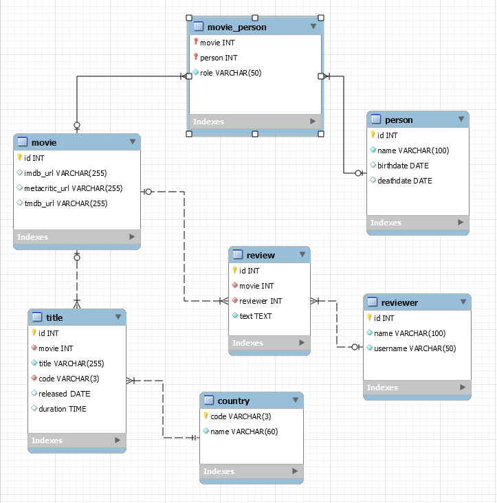

# [SocialHackersAcademy](https://www.socialhackersacademy.org/) - Database module - week 3 homework

[Instructions from SHA](https://github.com/SocialHackersCodeSchool/databases/blob/master/Week3/README.md)

## Draw a database design for a movie database

Design a database for a movie application. In this app a user can post reviews
and see information about each movie.

**Answer - The diagram**
 

### Create an .sql file to CREATE the tables for the database

**Answer**

[my_movies_db.sql](my_movies_db.sql)

# License and Copyright

Unless explicitly specified all this is copyrighted by Costas Stavrou, the
author of these Github pages and GPL-3 licensed.
